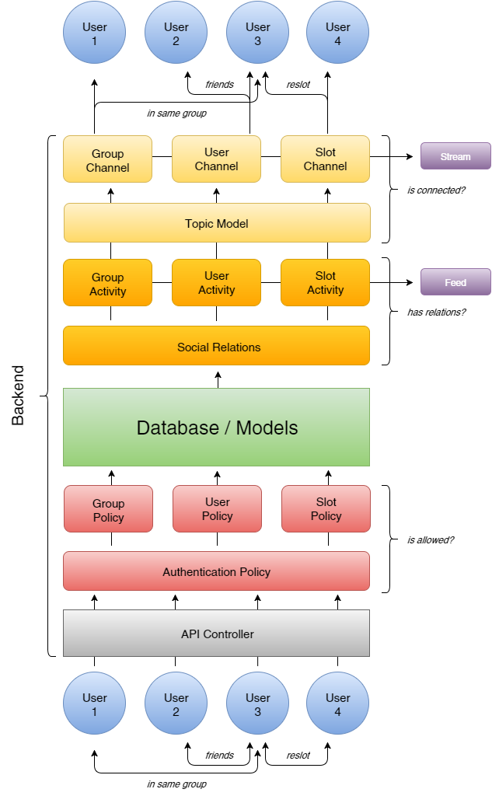

# TS RAILS BACKEND

* [CHANGELOG](CHANGELOG.md)
* [Api Endpoint Documentation](doc/api/v1/index.markdown)
* [Project's Agile Jira Work Board](https://timeslot.atlassian.net/projects/BKD/summary)
* [App-Specification](https://docs.google.com/a/timeslot.com/document/d/12MZDzthoK6RrKhuJKfERfI6xpvZi_DP6ri0VWbZmnPc/edit?usp=sharing) (google docs), [old app spec](https://timeslotapi.hackpad.com/IfMfC58g3jd#Timeslot-APP) (Hackpad)
* [Entity Relationship Diagram](doc/erd_adv-3.6.15.pdf) [[2](doc/erd_adv.pdf)] [[3](doc/erd.pdf)]
* [How-To Setup Development Environment](doc/setup_devenv.md)
* [Social Activity](doc/social_activity.md)
* [Links to Some Useful Extra Information](doc/useful_links.md)
* [Deployment Process](doc/deployment_process.md)

# Data Flow Concept


# Notes

## No delete & destroy

**Delete** and **Destroy** are globally disabled in ```lib/ts_prevent_deletion.rb```,
instead we use a db-column called **deleted_at** or set a specific state on the model. There is one exception, ```Device(s)``` can be removed from the db.

## Authorization

Authorization is done via a token in the http header which is compared to a locally saved token for every user. The token is invalidated on logout and regenerated on login.
On first signup the token is also created so a signed up user is already logged in.

## Authentication

We use [Pundit](https://github.com/elabs/pundit) for Authentication. In the ```app/policies/``` folder are all files which contain authentication logic.


# Environment

We develop on OSX and Ubuntu.
So far we use Heroku to deploy our backend.
We use Jenkins to test all commits to the timeslotinc github repo, usually PRs.

## Env Variables

Setting environment variables can be done e.g. via ```.env``` or with [another approach](http://stackoverflow.com/a/11765775/531439) which we use atm, but we'll might switch to Rails ```secrets.yaml```.


```bash
ENV['MAX_THREADS'] # number of concurrent Puma Webserver threads, defaults to 5 if not set
ENV['NOTIFICATION_WORKERS'] # number of concurrent SuckerPunch Notification Workers, defaults to 5 if not set
ENV['INLINE_WORKERS'] = 'false' # controls if sucker punch jobs run async
ENV['DB_POOL'] # number of available database connections, defaults to MAX_THREADS or 10 if both are not set, BUT should be at least MAX_THREADS + NOTIFICATION_WORKERS
# maximum on heroku free plan is 20

ENV['PG_EXPLAIN'] = 'true' # show output of pg EXPLAIN ANALYZE for all SELECT queries, use carefully

# pagination
ENV['PAGINATION_DEFAULT_MODE'] = 'upcoming' # if not provided by client
ENV['PAGINATION_DEFAULT_FILTER'] = none' # if not provided by client
ENV['PAGINATION_DEFAULT_LIMIT'] = '40' # if not provided by client
ENV['PAGINATION_MAX_LIMIT'] = '100'

ENV['SUGGESTED_USER_EMAIL'] = 'kalirad@me.com' # the email for the user which is suggested as a friend if a user had no friends yet

ENV['TS_SLOT_WEBSHARING_URL'] = 'http://timesl.ot/' # domain name for the slot websharing service app, given we have one
ENV['ENABLE_IOS_DB_CLEAN'] = 'true' # to enable the endpoint for db cleaning
```


# Internal Services

## Search Service (Elastic Search, Crawler)

The Data Team provides an elasticSearch - Slot Search Interface for it's crawler data.

```bash
ENV['TS_GLOBALSLOTS_SEARCH_SERVICE_URL']) # elastic search url
ENV['TS_GLOBALSLOTS_SEARCH_SERVICE_NAME'] # username
ENV['TS_GLOBALSLOTS_SEARCH_SERVICE_PASSWORD']

```
## Global Slot Retrieval Service

Allows to get a Global Slot by its **muid** (slot_uuid).
```
ENV['TS_DATA_MALL_URL'])
ENV['TS_DATA_MALL_NAME'] || "tsgatekeeper"
ENV['TS_DATA_MALL_PASSWORD'] || "***REMOVED***"
```

# External Services

The following env variables are available/expected:

## AWS

[Docs](http://docs.aws.amazon.com/sdkforruby/api/index.html)

```bash
ENV['AWS_ACCESS_KEY_ID']
ENV['AWS_SECRET_ACCESS_KEY']
ENV['AWS_REGION']
```

### We use the following services

* [AWS Simple Notification Service](http://aws.amazon.com/documentation/sns/)
    - Apple Push Notifications
* [AWS Simple Email Service](http://aws.amazon.com/documentation/ses/)
    - Password Reset Email

```bash
ENV['AWS_PLATFORM_APPLICATION_IOS'] # aws arn endpoint (iOS)

# enable push endpoints, if not set explicitly endpoint is enabled by default
# ENV['PUSH_DEFAULT'] = 'true'
ENV['PUSH_APNS'] = 'false'
ENV['PUSH_APNS_SANDBOX'] = 'true'
```

## Cloudinary

Cloud Service for our Media Data, via Heroku Addon, [Docs](http://cloudinary.com/).

For local testing a free account can be opened and the following vars need to be set:
```bash
ENV['TS_RAILS_BACKEND_CLOUDINARY_CLOUD_NAME']
ENV['TS_RAILS_BACKEND_CLOUDINARY_API_KEY']
ENV['TS_RAILS_BACKEND_CLOUDINARY_API_SECRET']
```

## Redis

Redis is to store our Activity Streams via a service like Heroku Redis Addon. The following var need to be set:
```bash
ENV['REDIS_URL']
```
For local testing you need a locally running redis server listening on *localhost:6379*

## Airbrake

for exception monitoring, via Heroku Addon, [Docs](https://airbrake.io/) | [Github](https://github.com/airbrake/airbrake)

## Papertrail

for logging, via Heroku Addon, [Docs](https://papertrailapp.com/) | [Heroku Docs](https://devcenter.heroku.com/articles/papertrail)

## New Relic

via Heroku Addon

# More Tools

## Webserver

* Start default rails dev server (s=server)

```bash
rails s
```

or use foreman:

```bash
gem install foreman
foreman start
```

## Specs / Tests

### Flags

Flag | Effect
-------------|------------------
```:focus``` | let only marked specs run
```:db``` | print the database interactions to the console, does also ```:focus``` the marked spec
```:explain``` | print postgres EXPLAIN ANALYZE for SELECT queries to console, does also ```:focus``` the marked spec
```:commit``` | persist data in database, see below
```:seed``` | load database seeds
```:keep_data``` | doesn't clean metaslot, baseslot, stdslot, reslot, friendship & user table for marked group, cleans after group has run, for read-only specs
```:vcr``` | use vcr to mock external requests, see below
```:aws``` | use aws to mock external requests to AWS service, see below
```:redis``` | use redis to indicates that data is stored into redis which has to be cleaned after each test
```:async``` | use async to mock asynchronously requests through sucker punch workers, see below
```:activity``` | used to turn on triggering activities (is off by default)

### [Database Cleaner Gem](https://github.com/DatabaseCleaner/database_cleaner)

Manages database transactions for specs/tests.
Default strategy is ```transaction```.
If a spec needs ```truncation```, a **:commit** flag can be set on the test.

```
describe "auditing", :commit do
# spec goes here
end
```

### [VCR](https://github.com/vcr/vcr)

The specs uses the vcr gem (and webmock gem), which records external requests on
the first run and on previous runs always returns this response. This makes that
specs faster and allows them to be run offline, but also hides if there had been
changes in the external API which breaks the comunication.

To enable outgoing http requests in specs (Rails test env)  edit the first line
in the ```spec/support/vcr_setup.rb``` file.

To enable outgoing http requests in the Rails Dev Env there is a setting in
the ```development.rb``` file:
```
WebMock.allow_net_connect!
```

### AWS

The specs uses the AWS webmock, which simulate external requests to AWS services.
This allows to test in an special environment where the changes would not store live.

### [Sucker Punch] (https://github.com/brandonhilkert/sucker_punch)

The specs uses a webmock to handle asynchronously tasks, which is internally handled by the sucker punch gem.
This allows to test worker threads inside rails specs.

### [Bullet](https://github.com/flyerhzm/bullet)

Detects n+1 database queries.

### Guard

To run specs automatically if a file was edited.
At the end of this document is my somewhat messy Guardfile with some customizations.

* [Example Guardfile](/doc/guardfile_silvio.md)

## Debugger / REPL

* [pry](http://pryrepl.org/screencasts.html)
* [pry-rails](https://github.com/rweng/pry-rails)
* [byebug](https://github.com/deivid-rodriguez/byebug)
* [pry-byebug](https://github.com/deivid-rodriguez/pry-byebug)

## API Documentation

The documentation is based on the *spec/acceptance* tests.
The DSL is outlined [here](https://github.com/zipmark/rspec_api_documentation#dsl).

### Generating API documentation

* This is done via gem [rspec_api_documentation](https://github.com/zipmark/rspec_api_documentation). Call:
```
rake docs:generate
```

Per default the documentation is generated as **markdown**.
The generated Markdown files will be in *doc/api* folder.

## Entity-Relationship Diagrams

Can be automatically created in two flavours, both with their up- and downsides:

* install graphviz with pango/cairo support.
```bash
brew install Caskroom/cask/xquartz
brew install graphviz --with-pangocairo
```
* gen simple ERD
```bash
bin/rake generate_lean_erd
```

* gen detailed ERD
```bash
bin/rake generate_adv_erd
```

## Git

At the moment we use a mix of the GitFlow Workflow and the Forking Workflow.

* [Git Workflow Backend Developer](doc/git_workflow_developer.md)
* [Comparing Workflows - Atlassian](https://www.atlassian.com/git/tutorials/comparing-workflows)


### Git Flow

* [GitFlow Explained](http://datasift.github.io/gitflow/IntroducingGitFlow.html)
* [GitFlow Tutorial](http://www.effectivetrainings.de/blog/2012/04/22/git-flow-einfaches-arbeiten-mit-dem-perfekten-git-workflow/) (german)

```
brew install git git-flow-avh
```

### Git Commit Commands for JIRA

* When commiting use the following commit message format:

`ACTION KEY #resolved <comment>`

* e.g. `git commit -m "ADD BKD-2 including module to stretch lifetime"`

* **KEY** is the Jira Issue Number
* **ACTION** should be one of **ADD**ition, **DEL**etion, **MOD**ification, **IMP**rovement, **FIX** for small bugfixes, **WIP** if you need to commit while work in progress, **WTF** in special cases...
* More detailed information on JIRA smart commit messages [here](https://confluence.atlassian.com/bitbucket/processing-jira-issues-with-commit-messages-298979931.html).

However, this is likely to change sooner or later... The JIRA-Github integration is not yet done.

## Coding Conventions / Styleguide

* If patching third party libraries we use a **ts_** prefix.
* The API Responses are in lowerCamelCase, the transformation from snake_case is automatically handled by jbuilder gem
* [rubocop](https://github.com/bbatsov/rubocop)
* [rails best practices](https://github.com/railsbp/rails_best_practices)

## Additional software you may want to use

#### JSON Tools

* [Cocoa Rest Client](http://mmattozzi.github.io/cocoa-rest-client/)
* [Postman](https://chrome.google.com/webstore/detail/postman-rest-client/fdmmgilgnpjigdojojpjoooidkmcomcm) - google chrome app
* [RESTClient](https://addons.mozilla.org/en-US/firefox/addon/restclient/) - addon for firefox

#### Database Tools

* [PGCommander](https://eggerapps.at/pgcommander/)
* [Navicat Essentials for POSTGRESQL](https://itunes.apple.com/de/app/navicat-essentials-for-postgresql/id466725643?l=en&mt=12)
* [PGAdmin](http://www.pgadmin.org/download/macosx.php) - not so fancy but free

#### Markdown viewers/editors for Mac

* [Marked 2](http://marked2app.com/)
* [Mou](http://25.io/mou/)
