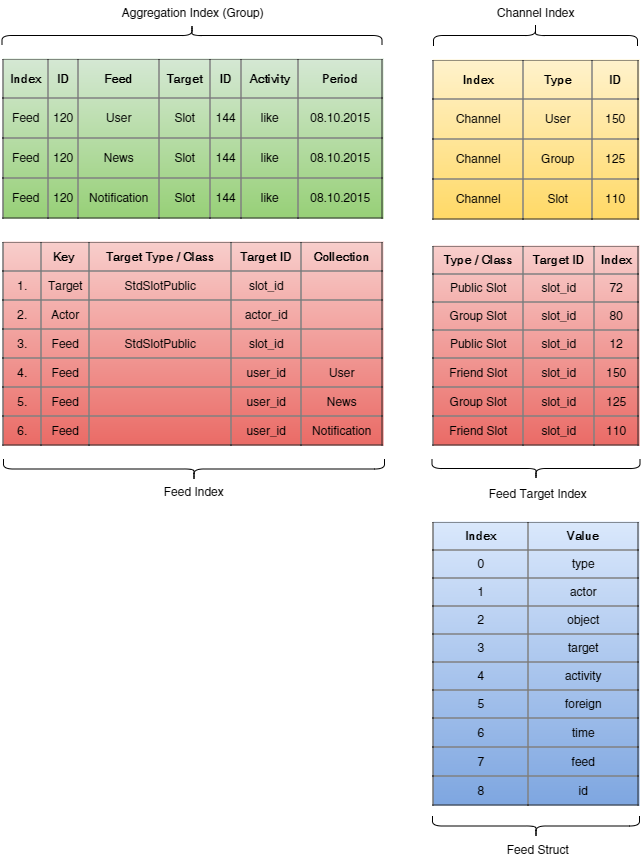
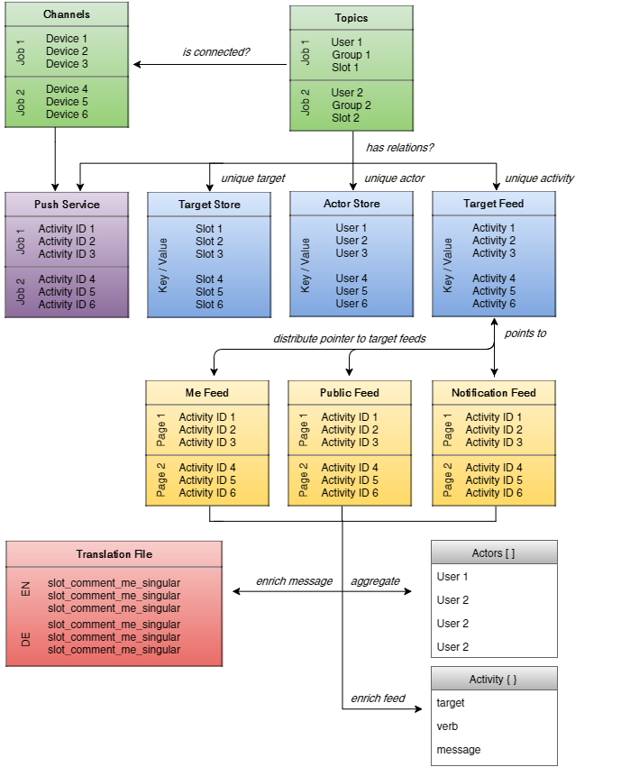

# Social Activity


The whole system is divided into 4 parts:

_WRITE_PROCESS_

1. Activity Objects (is the internal representation of an activity)
2. Distribution (distribute activities to feeds)

_READ_PROCESS_

3. Aggregation (collect and merge activities)
4. Message Composing (create personalized & multi lingual messages)

## The Follower Model

The Activity Distribution uses a bi-directional Follower Model which has generic capabilities (e.g. a group can follow a slot). These associations are used by the Social Context.

## The Social Context

The Social Context determines all involved users to where the activity has to be distributed. This context consists of:

#### Context Types:

1. Slot Context
2. User Context
3. Group Context

#### Context Relations:

1. Target related context (e.g. tagged users or reslotters of a slot)
2. Actor related context (e.g. friends of the actor)
3. Friend related context (e.g. friend of friends)
4. Group related context (e.g. the members of group where the slot was tagged)
5. Foreign related context (e.g. the creator of a slot or owner of a group)

## Activity Object

Each Activity Object has/requires a:
* Actor (the user who makes the activity)
* Target (where the activity belongs to, e.g. "Slot" if someone likes the slot)
* Action (the action/verb of the activity, e.g. "comment" or "like")

Each Activity Object can optionally also have a:
* Foreign (a user who belongs to the activity target, e.g. "Creator" or "Owner")
* Group (a group which belongs to the activity target)
* Visibility (the visibility which belongs to the activity target)
* Redirect (the target where the user is delegated when opening the activity)

## Re-Build: Topics, Follower, Followings, Activities, Feeds

Since we are using live aggregation we are able to change logic on the fly. Whenever we have to make changes in the logic of redis feed data we have a build script which can re-build all data with actual logic.

Type in console:

```bash
rake feed:build RAILS_ENV=development
```

For Heroku:

```bash
heroku run rake feed:build -a {APP_NAME}
```

This will perform the following steps:

1. Flush all redis data
2. Re-Build: Topics, Follower, Followings
3. Re-Build: Activities, Feeds

#### Overview Activity Feed Tasks:

```bash
# Refresh all feed caches
rake feed:refresh
```
```bash
# Update all shared objects + refresh caches
rake feed:update
```
```bash
# Rebuild follower model (social relations)
rake feed:relink
```
```bash
# Rebuild follower model + all feeds + shared objects
rake feed:build
```

##### Some redis commands for the rails console:

```bash
$> $redis.keys     # list redis keys
```
```bash
$> $redis.info     # show redis info
```
```bash
$> $redis.flushall # fush redis data
```

## Activity Topic Model

Each target has its own topic channel which a follower can subscribe to. This will often happens automatically, e.g.: if an user reslot a slot, the user also follows this slot. With a follow model we can handle the activity messages outside of the membership relation.


The same topic model is used for subscribing to a stream channel.

### Think depending to the activity target
To better understand the basic concept of activity model abstraction always keep a "target context" in mind, like:
* SlotActivity is an activity where the target belongs to a slot (e.g. "like")
* GroupActivity is an activity where the target belongs to a group (e.g. through "membership")
* UserActivity is an activity where the target belongs to a user (e.g. through "friendship")

The same context should be valid on: feeds, topics, followers, followings (except channels).


## Activity Distribution Model

The "Activity Dispatcher" distribute the activities to the feeds and channels as a background process through an asynchronous worker thread.


#### Distribution Strategy: Read-Opt vs. Write-Opt
Read-Opt: Activities will be delegated to each users feed.
Write-Opt: Stores all activities as unique to the target feed.

Actual we are using the *Write-Read-Opt*-Strategy. Each activity will be stored respectively to its target feed index (unique). Furthermore activities will be dispatched through social relations and stores a "pointer" to the target feed index.

A = Actors

F = Followers (e.g. friends or members of a group)

| | Read-Opt | Write-Opt | Write-Read-Opt (Bridge) |
|----|----|----|----|
| Read Access: | F | F * (A + F) | A + F + 1 |
| Validations: | F | ALL | F + 1 |
| Write Access: | A * (A + F) | A | A * (A + F) + 1 |
| Capacity: | A * (A + F) | A | A + 1 |

#### 1. Example
3 users do an activity + 25 followers get a notification and makes a request to this activity (500.000 Activities already exist through relations of all 28 users)

| | Read-Opt | Write-Opt | Write-Read-Opt (Bridge) |
|----|----|----|----|
| Read Access: | 25 | 700 | 29 |
| Validations: | 25 | 500.025 | 26 |
| Write Access: | 84 | 3 | 85 |
| Capacity: | 84 | 3 | 4 |

#### 2. Example
25 users do an activity + 3 followers get a notification and makes a request to this activity (500.000 Activities already exist through relations of all 28 users)

| | Read-Opt | Write-Opt | Write-Read-Opt (Bridge) |
|----|----|----|----|
| Read Access: | 3 | 84 | 29 |
| Validations: | 3 | 500.003 | 4 |
| Write Access: | 700 | 25 | 701 |
| Capacity: | 700 | 25 | 26 |

#### NOTE
"Write-Opt" also has the effect, that all activities will be determine on each new request, there is no extra "activity-snapshot". If a user follows a slot, the user will automatically get all old activities which are stored to this target feed. If the user unfollow the slot, all activities from this slot are also removed. Furthermore the pagination on Write-Opt-Targetings is very ineffective, the whole data has to be fetched and has to be sorted by date (to determine the current/next page) as well as the visibility and policy has to be validated on full data on each request. These are good reasons for why we do not use aggressive Write-Opt-Strategy.

## Live Aggregation
In handy to make changes on the aggregation logic we are currently no storing aggregation logic into the feed data to save backward compatibility. The feed data includes the default basic data of an activity as an abstraction of it and can be reproduced ("enriched") anytime.

## Activity Feed Schema

There is no logic inside the code which can affect the message. This guarantees that each message is translatable to each language. Instead we enrich the message text "on the fly" during the aggregation process.





## Multi-lingual Message Composing


## Activity Feed Dispatcher (Read/Write-Opt)




